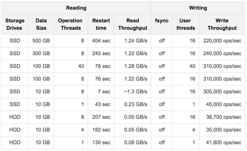
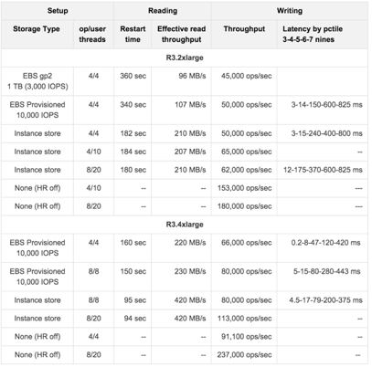

In this section you can find performance test summaries which are results of benchmark tests performed with a single Hazelcast member running on a physical server and on AWS R3. 

#### Performance on a Physical Server

The member has the following:

- An IMap data structure with High-Density Memory Store. 
- Its data size is changed for each test, started from 10 GB to 500 GB (each map entry has a value of 1 KB). 

The tests investigate the write and read performance of Hot Restart Persistence and are performed on HP ProLiant servers with RHEL 7 operating system using Hazelcast Simulator. 

The following are the specifications of the server hardware used for the test:

* CPU: 2x Intel(R) Xeon(R) CPU E5-2687W v3 @ 3.10GHz – with 10 cores per processor. Total 20 cores, 40 with hyper threading enabled.
* Memory: 768GB 2133 MHz memory 24x HP 32GB 4Rx4 PC4-2133P-L Kit

The following are the storage media used for the test:

* A hot-pluggable 2.5 inch HDD with 1 TB capacity and 10K RPM.
* An SSD, Light Endurance PCle Workload Accelerator.

The below table shows the test results.

#### Performance on AWS R3

The member has the following:

- An IMap data structure with High-Density Memory Store. 
- IMap has 40 million distinct keys, each map entry is 1 KB. 
- High-Density Memory Store is 59 GiB whose 19% is metadata. 
- Hot Restart is configured with `fsync` turned off. 
- Data size reloaded on restart is 38 GB.

The tests investigate the write and read performance of Hot Restart Persistence and are performed on R3.2xlarge and R3.4xlarge EC2 instances using Hazelcast Simulator.

The following are the AWS storage types used for the test:

- Elastic Block Storage (EBS) General Purpose SSD (GP2).
- Elastic Block Storage with Provisioned IOPS (IO1). Provisioned 10,000 IOPS on a 340 GiB volume, enabled EBS-optimized on instance.
- SSD-backed instance store.

The below table shows the test results.

